# P2P Payment Demo

## 1. Project Overview

This project demonstrates a simple application that captures and submits a **Person-to-Person (P2P) payment request**, implemented using the following application stack:

* **Frontend:** Angular with MDB UI components
* **Backend:** FastAPI REST API
* **Data Store:** Redis (used as a lightweight database, although the same functionality could also be implemented using a flat file such as `.txt` or `.json` for sample data)
* **Containerization:** Docker (FastAPI and Redis run together, mimicking a typical web service deployment)

The application allows users to submit payment requests via a web interface. The request is handled by the backend API, which validates the input and simulates a funds transfer between two accounts stored in Redis.

The main objective of this project is to **demonstrate frontend–backend API integration and showcase backend validation logic and HTTP error handling**.

---

# 2. Technology Stack

| Layer            | Technology           | Purpose                          |
| ---------------- | -------------------- | -------------------------------- |
| UI               | Angular + MDB UI Kit(free) | Payment form and API integration |
| Backend          | FastAPI              | Business logic and validation    |
| Data Store       | Redis                | Sample account persistence       |
| API Testing      | Postman              | Initial API testing              |
| Containerization | Docker               | Run backend and Redis together   |

---

# 3. System Architecture

### Workflow Overview

1. User enters payment details in a web form (Angular component/app).
2. Angular sends a request to the FastAPI backend.
3. FastAPI validates request fields and handles **ERR001 – ERR004** as well as data type validation errors.
4. Redis retrieves account data for transaction validation.
5. If validation succeeds:

   * balances are updated
   * a transaction ID is generated
   * the response is returned to the frontend.

---

# 4. Project Structure

```
P2P-PAYMENT-APP
│
├── backend
│   │
│   ├── app
│   │   ├── api
│   │   │   └── payment.py
│   │   │
│   │   ├── models
│   │   │   ├── schemas.py
│   │   │   └── validationhandler.py
│   │   │
│   │   ├── services
│   │   │   └── redis_service.py
│   │   │
│   │   ├── main.py
│   │   └── data_prep.py
│   │
│   └── requirements.txt
│
├── frontend
│   │
│   ├── src
│   │   ├── app
│   │   │   ├── error-modal
│   │   │   ├── interceptors
│   │   │   ├── payment
│   │   │   ├── app.component.ts
│   │   │   ├── app.component.html
│   │   │   └── app.module.ts
│   │   │
│   │   ├── assets
│   │   ├── environments
│   │   ├── index.html
│   │   └── main.ts
│   │
│   ├── angular.json
│   ├── package.json
│   └── README.md
│
├── scenario-screenshots
│
└── docker
    └── docker-compose.yml
```

---

# 5. Getting the Project from Git

Clone the repository:

```bash
git clone https://github.com/hkandjimi/p2p-payment-app.git
cd p2p-payment-app
```

---

# 6. Running Backend and Redis (Docker) — Web Service Simulation

The **FastAPI backend and Redis database are containerised** and can be started together using Docker.

Start services:

```bash
docker-compose up --build
```

This command starts: FastAPI backend and Redis data store

FastAPI will be accessible at:

```
http://localhost:8000
```

Redis runs internally on:

```
port 6379
```

---

# 7. Loading Sample Account Data

Sample account data is loaded using the script:

```
backend/app/data_prep.py
```

This script inserts predefined account records into Redis to simulate a banking environment.

### Example Accounts

```python
accounts = {
    "1234567890": {
        "first_name": "Jane",
        "last_name": "Doe",
        "type": "Current",
        "balance": 1000,
        "currency": "NAD",
        "status": "ACTIVE"
    },
    "1234567892": {
        "first_name": "John",
        "last_name": "Wick",
        "type": "Savings",
        "balance": 150,
        "currency": "NAD",
        "status": "ACTIVE"
    },
    "0987654321": {
        "first_name": "Herman",
        "last_name": "Kandjimi",
        "type": "Fixed",
        "balance": 13100800,
        "currency": "NAD",
        "status": "ACTIVE"
    },
    "9987654321": {
        "first_name": "Leena",
        "last_name": "Kandjimi",
        "type": "Business",
        "balance": 24000,
        "currency": "NAD",
        "status": "ACTIVE"
    }
}
```

---

# 8. API Testing (Postman)

Before connecting the frontend UI, the FastAPI endpoints were tested using **Postman** to validate:

* API request structure
* validation responses
* Redis connectivity
* error handling

---

## Test Account Endpoint

The system includes a test route for retrieving account information.

```
GET /api/p2p-payment/{account_number}
```

Example:

```
GET http://localhost:8000/api/p2p-payment/1234567890
```

### Example Response

```json
{
  "first_name": "Jane",
  "last_name": "Doe",
  "type": "Current",
  "balance": 1000
}
```

This endpoint verifies that account data exists in Redis.

---

## Test Payment Endpoint

Payment requests are sent to:

```
POST /api/p2p-payment
```

### Example Request

```json
{
  "clientReference": "REF-20260315-45231",
  "senderAccountNumber": "1234567890",
  "receiverAccountNumber": "1234567892",
  "amount": "100",
  "currency": "NAD",
  "reference": "Lunch payment"
}
```

### Example Response

```json
{
  "status": "SUCCESS",
  "errorCode": null,
  "transactionId": "TXN-2026031545231",
  "message": "Payment processed successfully. Your new balance N$ 1107.00"
}
```

---

# 9. Frontend Setup (Angular)

Navigate to the frontend directory:

```bash
cd frontend
```

Install dependencies:

```bash
npm install
```

Start Angular development server:

```bash
ng serve
```

Access the web app:

```
http://localhost:4200
```

---

# 10. Key Assumptions

Several assumptions were made to focus the project on **API integration and backend validation**.

---
<ol type="">

## 1. No Frontend Validation 

Form validation is **not performed on the frontend**.
All validation logic is handled by the **FastAPI backend**. Frontend validation was intentionally excluded to test `incorrect requests`, `wrong data` and `test backend validation logic`

---

## 2. clientReference Generated on Frontend

The `clientReference` is generated by the frontend using the format: `REF-YYYYMMDD-XXXXX`

Where: `YYYYMMDD` = current date and `XXXXX` = unique value derived from adding milliseconds of the current timestamp and a random number between `100` and `900`

Example:`REF-20260315-58231`

---

## 3. Transaction ID Generation

When a transaction is successful, the backend generates a transaction number using the `clientReference`.

Format:`TXNYYYYMMDDXXXXX`

Example:`TXN2026031558231`

---

## 4. User Authentication Assumed

The system assumes the user:

* has already authenticated
* is authorised to perform transactions

In a real payment system, additional confirmation would be required, such as **OTP verification**.


---

## 5. Form Fields Stored as Strings


All form inputs are stored as **strings** in Angular. This allows testing scenarios such as: incorrect data types, invalid amounts and unexpected inputs. The backend performs the required validation.


---

## 6. Empty Fields Removed from Request

When a form field is empty, the Angular frontend removes that field from the JSON request before sending it to the API.

The backend then determines whether required fields are missing.

---
</ol>

# 11. Error Handling

Angular implements a **global HTTP interceptor** that captures API errors and displays them in a modal component. This provides a consistent UI for both **successful responses and error responses**.

### Example FastAPI Error Response

```json
{
  "status": "FAILED",
  "errorCode": "ERR003",
  "transactionId": null,
  "message": "Invalid currency"
}
```

---

# 12. Running the Full System

Start services in the following order.

### 1. Start Backend + Redis

```bash
docker-compose up --build
```

### 2. Start Angular UI

```bash
cd frontend
ng serve
```

Access the web application:

```
http://localhost:4200
```

---

# 13. Example Payment Scenario

The following scenarios were used to test the application behaviour and backend validation logic.  
Each scenario demonstrates how the system responds to different user inputs and validation conditions.

Screenshots of the Angular UI responses are included for reference.

---
<ol type="">

##  Landing page

This is the entry point for the payment process. The main interface for the person making the payment.
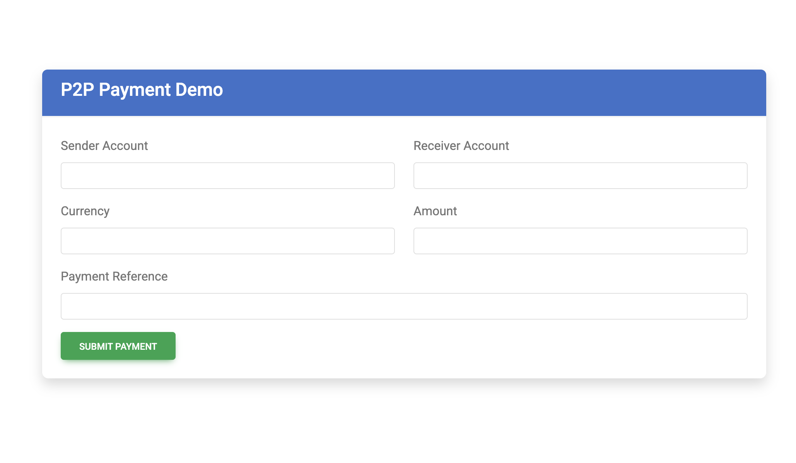

## 1. Scenario 1: No Data Entered 

In this scenario the user submits the form without entering any data.
Expected behaviour:
- The frontend sends an empty JSON request (empty fields are removed before submission).
- The FastAPI backend validates the request and identifies missing required fields.
- An appropriate validation error is returned.

Example response:

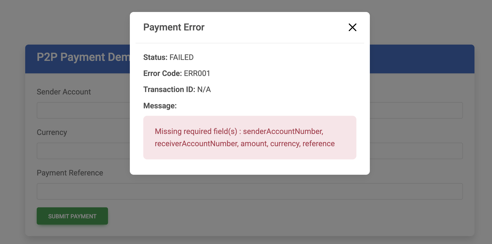


---

## 2. Scenario 2: Incorrect Account Number Format

In this scenario the sender or receiver account number does not follow the expected format. Expected behaviour:

- Backend validation detects the incorrect format.
- The transaction is rejected.

Example response:

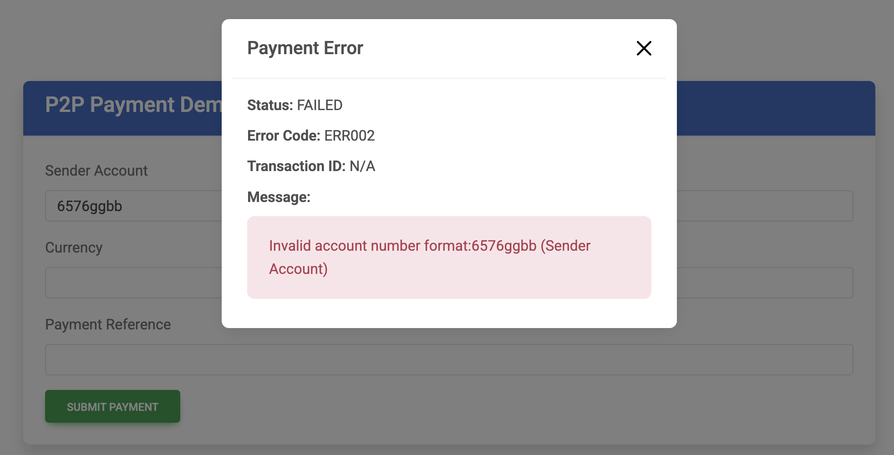

---
## 3. Scenario 3: Wrong Currency

The system only supports NAD (Namibian Dollar).

Expected behaviour:
- Backend validation detects incorrect currency.
- Transaction is rejected.

Example response:

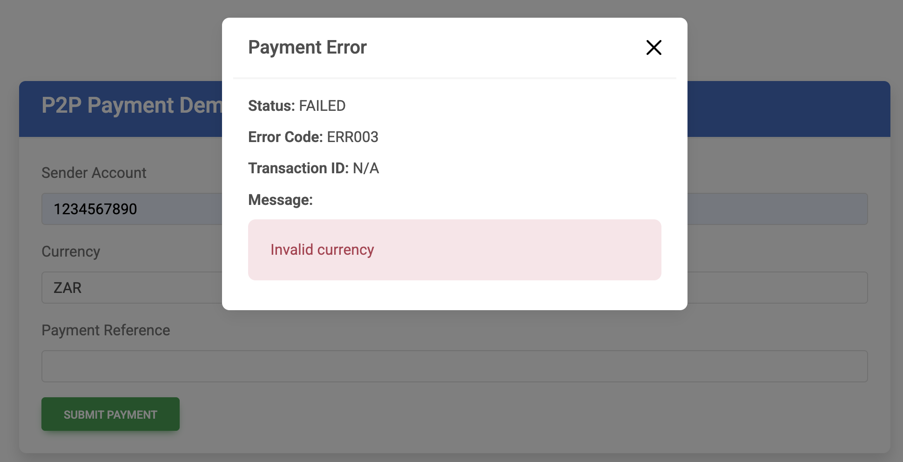

---
## 4. Scenario 4: Invalid Amount (Negative Value)
In this scenario the user attempts to transfer a negative value.

Expected behaviour:
- Backend validation detects the invalid amount.
- Transaction is rejected.

Example response:

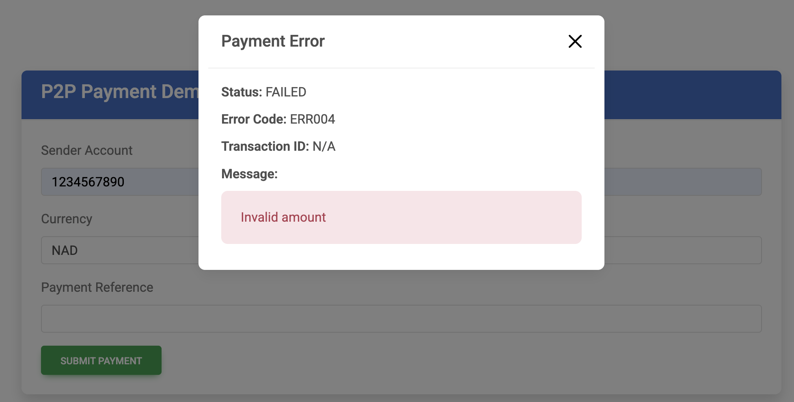

---
## 5. Scenario 5: Insufficient Funds

In this scenario the sender account does not have enough balance to complete the transfer.

Expected behaviour:

- Backend verifies account balance.
- Transaction is rejected due to insufficient funds and the current balance is displayed.

Example response:

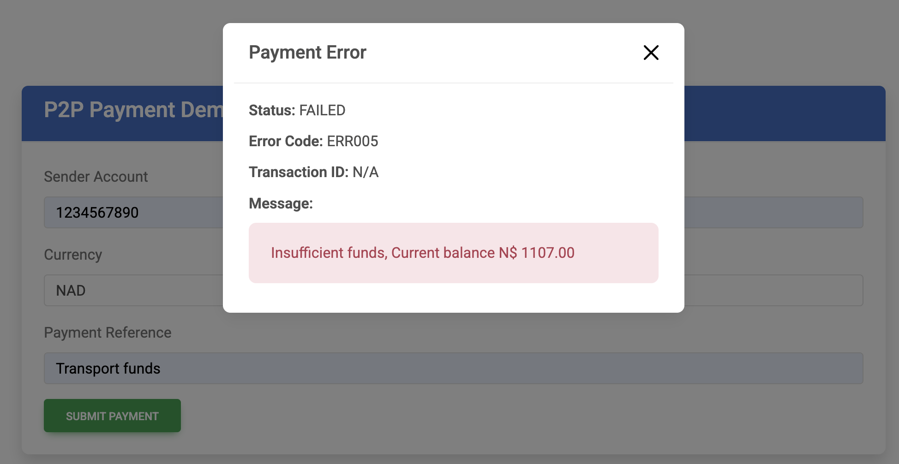

---
## 6. Scenario 6: Reference Too Long

The payment reference field has a maximum allowed length (50).

Expected behaviour:
- Backend validation detects the long length.
- Request is rejected.

Example response:

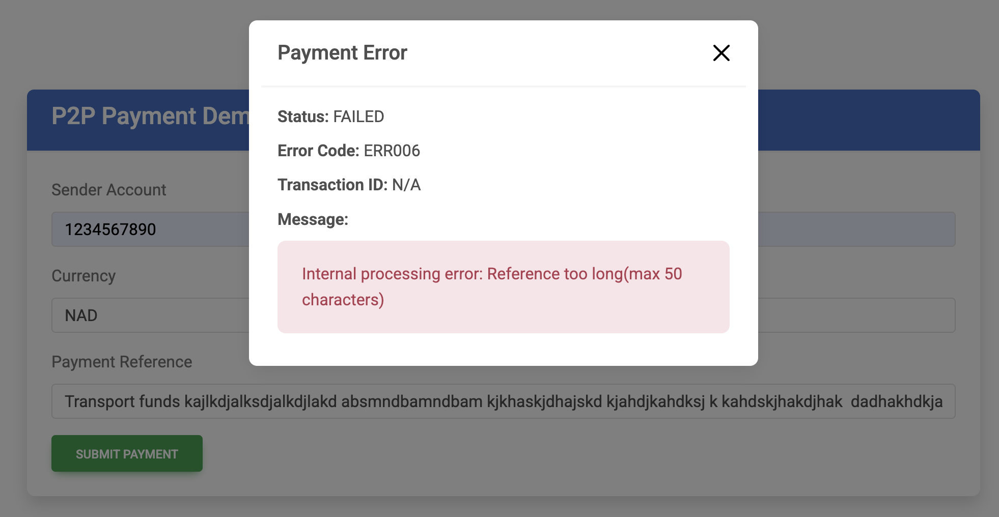

---
## 7. Scenario 7: Invalid Account Number 

In this scenario the account number format is valid, but the account does not exist in Redis. Check is done on both sender and reciever account.


Expected behaviour:
- Redis lookup fails.
- Backend returns account not found error.

Example response:

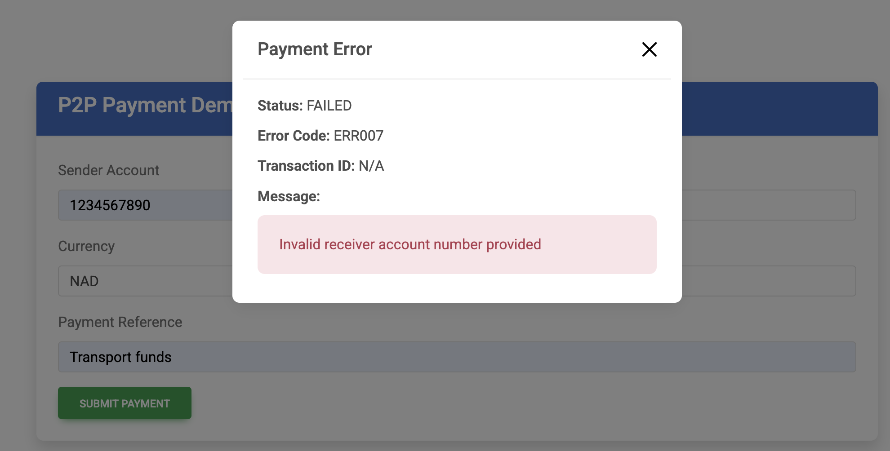

---
## 8. Scenario 8: Data Validation

This scenario tests general data validation where multiple fields contain incorrect values types.

Expected behaviour:
- Backend performs validation checks.
- Returns the relevant validation error.

Example response:
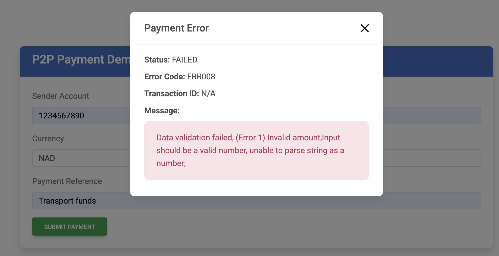

**ALTERNATIVELY ERROO6-ERR008, COULD ALL BE CONSIDER AS INTERNAL ERRORS(500)**

---

## 9. Scenario 9: Successful Transaction

A valid transaction between two existing accounts, with all required fields supplied and the sender's amount is less than the transfer amount.

Backend processing steps:
- Validate request fields
- Verify sender and receiver accounts
- Confirm sender balance
- Deduct funds from sender
- Credit receiver account
- Generate transaction ID
- Display sender's new balance

Example response:
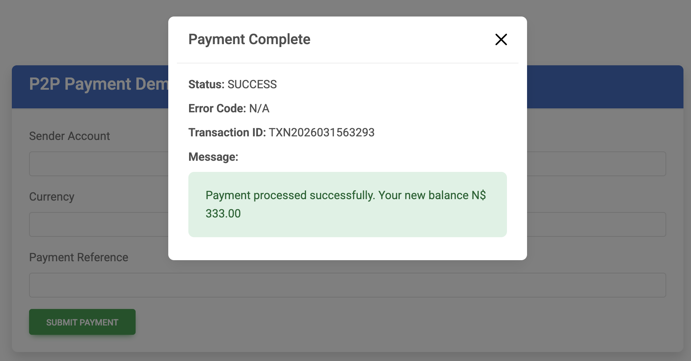

---

## 10. Payment Testing with Postman

The payment endpoint was tested using Postman before integrating the Angular frontend.

Postman was used to verify:
- API connectivity
- request validation
- transaction logic
- Redis integration

Example request:

`POST` http://localhost:8000/api/p2p-payment

```JSON
{
  "clientReference": "REF-20260315-45231",
  "senderAccountNumber": "1234567890",
  "receiverAccountNumber": "1234567892",
  "amount": "100",
  "currency": "NAD",
  "reference": "Lunch payment"
}
```

Example response:
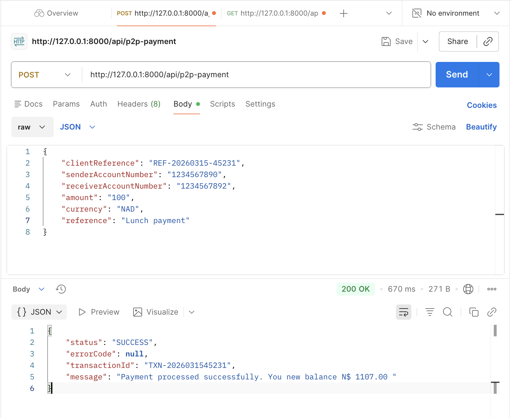

---
## 10. Account Details with Postman

The account retrieval endpoint was tested to confirm that Redis data is accessible through the API.

Example request:

`GET` http://localhost:8000/api/p2p-payment/1234567892

Example response:
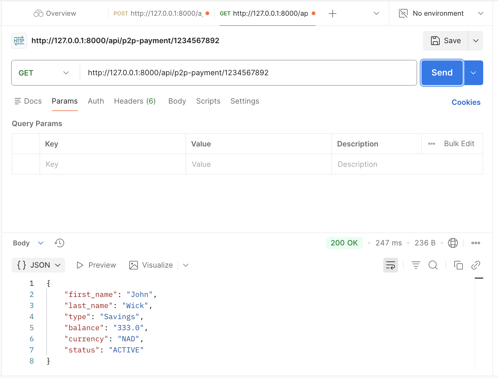

---

</ol>